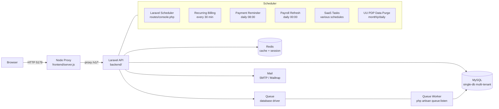
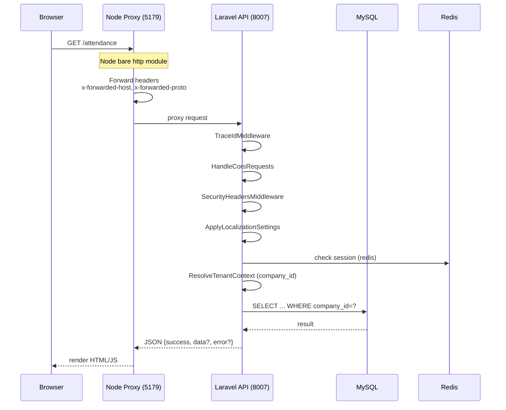
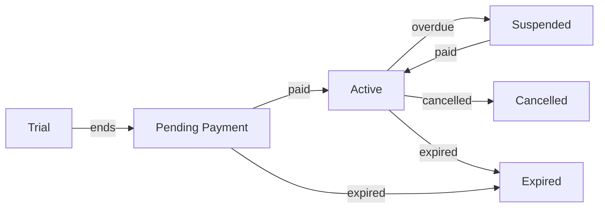

# Arkav HCM

Single-repository Human Capital Management system — SaaS multi-tenant untuk perusahaan Indonesia.

**Tujuan dokumen ini:** Buku panduan developer. Semua arsitektur, keputusan teknis, skema RBAC, deployment, dan standar kode tercatat di sini.

---

## Table of Contents

1. [Architecture](#architecture)
2. [Feature Matrix](#feature-matrix)
3. [Tech Stack](#tech-stack)
4. [RBAC & Multi-Tenant](#rbac--multi-tenant)
5. [SaaS Platform](#saas-platform)
6. [Frontend Architecture](#frontend-architecture)
7. [Security Architecture](#security-architecture)
8. [Background Jobs & Scheduler](#background-jobs--scheduler)
9. [Indonesia Compliance](#indonesia-compliance)
10. [Database Schema](#database-schema)
11. [API Conventions](#api-conventions)
12. [Development Setup](#development-setup)
13. [Testing Strategy](#testing-strategy)
14. [Deployment](#deployment)
15. [Project Structure](#project-structure)
16. [Key Decisions & Protected Patterns](#key-decisions--protected-patterns)
17. [Documentation Map](#documentation-map)
18. [Performance Optimizations](#performance-optimizations)

---

## Architecture

### High-Level System



### Request Flow



### Deployment Topology

Two deployment modes:

**Docker / VPS:**
```
Nginx (port 443) → Node Proxy (5179) → Laravel API (8007) → MySQL + Redis
                                    → Queue Worker → MySQL
                                    → Scheduler (cron: * * * * * php artisan schedule:run)
```

**Shared hosting (artifact build):**
```
Local: composer install + npm run build → artifact zip
Server: extract → web root → PHP-FPM → MySQL
      → cron job for queue:   * * * * * php artisan queue:work --stop-when-empty
      → cron job for schedule: * * * * * php artisan schedule:run
```
No Node proxy on shared hosting — Laravel serves assets directly.
No Composer/npm on server — all dependencies pre-built in artifact.

---

## Feature Matrix

50+ features across HCM + SaaS domains. Status berdasarkan route runtime di `backend/routes/api/` — **bukan** dokumentasi fitur (beberapa dokumen di `docs/features/` mungkin outdated).

### HCM Core ✅

| # | Feature | Key Details |
|---|---------|-------------|
| 1 | Identity & Auth | Register, login, logout, token, RBAC |
| 2 | Organization & Employees | CRUD employees, departments, designations, company structure |
| 3 | Attendance & Shift | Check-in/out, GPS/location, selfie (biometric consent), timesheets, shift CRUD + schedule timing, corrections, reports |
| 4 | Overtime | PP 35/2021 calculator, overtime types, requests |
| 5 | Leave & Holidays | Leave requests + approval workflow, holiday calendar, leave settings (types, policies, accrual), yearly carry-forward, monthly accrual |
| 6 | Company Policies | Policy CRUD with attachment |
| 7 | Ticketing | Helpdesk, SLA, assignment history, comments, attachments |
| 8 | Performance Review | Cycles, indicator templates/items, review workflow employee→manager→admin |
| 9 | Goal Tracking | Goal types (admin), goals scope me/team/all, CSV export |
| 10 | Training | Training types, trainers, trainings, participants, tenant/RBAC guard |
| 11 | Promotion | Promotion records (admin-only), list + modal CRUD |
| 12 | Resignation | Resignation records (admin list/mutasi), self read + employee detail section |
| 13 | Termination | Termination records (type + dates + reason) |
| 14 | Asset Management | Asset categories CRUD, assets CRUD + assign/return/issue-report/attachments, feature-gated |
| 15 | Document Center | Employee documents CRUD + categories + download, feature-gated |
| 16 | Calendar Events | Calendar events CRUD, feature-gated |
| 17 | Notes | Notes CRUD |
| 18 | FAQ | FAQ CRUD + bulk delete |
| 19 | Knowledge Base | Config-driven `/knowledgebase`, categories, articles |
| 20 | Global HRMS Search | Ctrl+/, RBAC-aware catalog, quick dropdown + full result panel |
| 21 | Data Privacy (UU PDP) | Biometric consent, AI consent, erasure requests (self + admin), security incident management |
| 22 | AI Assistant | Intent-classifier chat, RBAC gate (self/admin/global intents), LLM integration, conversation memory, audit log |
| 23 | Notifications | 40+ events, multi-channel (database/mail), delivery monitoring + retry, preferences per event, inbox read/unread |
| 24 | Approval Settings | 6 modules (leave, overtime, resignation, termination, expense, offer), chain/single mode, approver sequencing |
| 25 | Reporting System | Snapshot-based async reports, CSV/Excel/PDF export, live + archive mode, RBAC gated |
| 26 | Settings | Generic key-value store, invoice settings (prefix, due days, tax, rounding), file upload |
| 27 | Locations / Wilayah Sync | Sync from wilayah.id, cascading province/regency/district/village lookup, monthly scheduler |

### Payroll ✅

| # | Feature | Key Details |
|---|---------|-------------|
| 22 | Salary Components | Master komponen gaji (Indonesia flags: PTKP, BPJS, THR, etc.), company_id null = global |
| 23 | Payroll Runs | Periods CRUD, draft/final runs, slip lines, employee self-service payslip |
| 24 | Payroll Items | Custom items / taut master, CRUD |
| 25 | Employee Salary | Base salary, fixed allowance, overtime integration, compliance |
| 26 | Payslip | Self-service, monthly + THR + PKWT aggregation, PDF download |
| 27 | Payroll THR | Yearly setup, batch generate/disburse/post-payroll, slip PDF, reconciliation gate |
| 28 | Payroll PKWT Compensation | Contract-end compensation preview, standalone payroll generate, payment flow |
| 29 | Tax Governance | `/tax-rates`, employee tax profile, salary component tax flags, PP 21 engine, platform tax compliance |
| 30 | SPT Masa PPh 21 | Generate snapshot from finalized payroll, mark-ready/submit lifecycle, CSV export DJP-style |
| 31 | Employee Allowance Governance | Reference, policies (CRUD + activate + history), assignments (CRUD), reports + export |
| 32 | BPJS Governance | Policies CRUD, employee membership, reports + export, rate baselines per program |
| 33 | Email Settings | Show/update settings, mailtrap status, test connection (throttled) |

### SaaS / Platform ✅

| # | Feature | Key Details |
|---|---------|-------------|
| 34 | Packages | CRUD + feature mapping + add-on catalog, feature classification DB override |
| 35 | Subscriptions | Lifecycle CRUD + renew, change requests (downgrade/cancel approval), status filters |
| 36 | Purchase Transactions | CRUD + export, payment tracking |
| 37 | Domain Management | Domain CRUD + verify + verification details |
| 38 | Invoices | CRUD + mark-paid/sent + PDF preview/download + send email |
| 39 | Payments | CRUD + verify + bulk upload (CSV import) |
| 40 | Reconciliation | Export CRUD with download |
| 41 | User Management | Role-permission CRUD + assignment, audit trail |
| 42 | Super Admin Dashboard | KPI/metrics, companies list + detail, user stats + retention, revenue (monthly/forecast/by-plan), subscription health, audit logs |
| 43 | Landing Pages | Public landing page with packages/trial signup (PublicLandingController) |
| 44 | Mock Payment (Dev) | Stub payment gateway for dev/testing |
| 45 | Billing Overview | Company billing status, renewal monitoring + anomaly detection |
| 46 | Platform Tax (SaaS) | SPT PPN, SPT PPh 23, SPT PPh Badan, dashboard export |

### Not Yet Implemented 📋

Tidak ada fitur partial. Hanya 2 fitur yg belum ada implementasi sama sekali:

| # | Feature | Notes |
|---|---------|-------|
| 47 | Recovery Vault | No code in repo |
| 48 | Export Governance | No code in repo |

---

## Tech Stack

| Layer | Technology | Notes |
|-------|-----------|-------|
| **Backend** | Laravel 12, PHP 8.2+ | Single app, route-level domain separation |
| **Frontend Assets** | Vite + React + Tailwind CSS | via `laravel-vite-plugin` |
| **Proxy Server** | Node.js (bare `http` module) | `frontend/server.js`, dev only |
| **Database** | MySQL 8 | Single-database multi-tenant via `company_id` |
| **Cache** | Redis via `predis/predis ^3.5` | Pure PHP, no C extension needed |
| **Session** | Redis (production) / Database (fallback) | `SESSION_DRIVER=redis` |
| **Queue** | Database driver (MySQL) | Reliable, no orphan jobs |
| **PDF** | DomPDF 3.x | Payslip, reports |
| **Spreadsheet** | PhpSpreadsheet 5.x, League CSV 9.x | Exports, reports |
| **Image** | Intervention Image 3.x | Profile photos, selfie |
| **Payment Gateway** | Midtrans (production) / Stub (dev) | `midtrans/midtrans-php ^2.6` |
| **Logging** | Laravel Pail (dev), Stack (prod) | `LOG_CHANNEL=stack` |
| **Testing BE** | PHPUnit 11.x, Larastan/PHPStan | 1132 tests, 9078 assertions |
| **Testing FE** | Vitest 4.x + jsdom | Frontend JS tests |
| **Static Analysis** | PHPStan 2.x, Larastan | `vendor/bin/phpstan analyse` |
| **CI** | GitHub Actions | `.github/workflows/test.yml` |

---

## RBAC & Multi-Tenant

### Role Model

| Role | Auth Condition | Access Scope |
|------|---------------|--------------|
| **Anonim** | Not logged in | Only whitelisted public routes (onboarding, health) |
| **Authenticated** | Cookie/token valid | Basic authenticated access |
| **Karyawan** | Authenticated + `hcmAdmin !== true` | Self-data, company-scoped |
| **HCM Admin** | `hcmAdmin === true` | Company-scoped admin access |
| **Super Admin** | `is_super_admin === 1` | Cross-tenant, platform management |

### Multi-Tenant Isolation

- **STRICT:** Every query MUST include `company_id` in WHERE clause for tenant-scoped data.
- **Roles** are company-scoped (`company_id`). Platform roles (super_admin) have no `company_id`.
- **Permissions** are global (no `company_id`), linked to role via `hcm_role_permissions` + `company_id`.
- **Super-admin-only:** role/permission CRUD.

### Server-Side Enforcement

RBAC enforced server-side, not just UI hiding.

```php
// API routes — middleware chain
Route::middleware(['api.token', 'tenant.context'])->group(function () {
    Route::middleware('hcm.api.global-admin')->group(function () {
        // Super admin only
    });

    Route::middleware('hcm.api.feature:payroll')->group(function () {
        // Feature-gated, admin-scoped
    });
});

// Web routes
Route::middleware(['web', 'hcm.web.admin'])->group(function () {
    // HCM Admin only
});
```

### Middleware Aliases

| Alias | Class | Purpose |
|-------|-------|---------|
| `api.token` | `AuthenticateApiToken` | Validates Bearer token or `arcav_access_token` cookie |
| `tenant.context` | `ResolveTenantContext` | Resolves `company_id` from token/user |
| `hcm.api.global-admin` | `EnsureGlobalHcmApiAdmin` | Super admin only for API |
| `hcm.api.feature` | `EnsureCompanyFeatureForApi` | Feature-gated API access |
| `hcm.web.admin` | `EnsureHcmWebAdminPage` | HCM Admin web page guard |
| `hcm.web.global-admin` | `EnsureGlobalHcmWebAdminPage` | Super admin web page guard |
| `hcm.web.primary-super-admin` | `EnsurePrimarySuperAdminCodeOnePage` | Primary super admin only |
| `hcm.web.feature` | `EnsureCompanyFeatureForWebPage` | Feature-gated web page |
| `hcm.web.employee` | `EnsureEmployeeScopedWebPage` | Employee self-service guard |
| `hcm.web.asset-management` | `EnsureAssetManagementWebAccess` | Asset module guard |
| `biometric.consent` | `RequiresBiometricConsent` | Biometric feature consent |

### Route Guard Policy (Web Pages)

- Whitelisted public paths: defined in `EnsureHcmWebPagesAuthenticated`.
- Guest users on non-public routes → `error-404-guest` view (404, not 401).
- All web routes require auth by default.

Source: `docs/security/hcm-web-route-guard.md`

---

## SaaS Platform

### Subscription Lifecycle



### Billing Pipeline

| Job | Schedule | Function |
|-----|----------|----------|
| `ProcessRecurringSubscriptionBilling` | Every 30 min | Renewals, expiration reminders |
| `SendPaymentReminder` | Daily 08:00 | Email reminders for unpaid invoices |
| `ConvertExpiredTrialsToPendingPaymentJob` | Daily 00:20 | Trial → invoice |
| `TerminateExpiredSubscriptionsJob` | Daily 00:30 | End-date passed → terminate |
| `SuspendServicesForOverdueInvoicesJob` | Daily 06:00 | Overdue grace → suspend |
| `ReconcilePendingRenewalPayments` | Every 30 min | Gateway status reconciliation |
| `ApplySubscriptionChangeJob` | Every 15 min | Approved downgrade/cancel |
| `CheckEmployeeCountLimitsJob` | Daily 01:00 | Plan limit enforcement |
| `ClearRevenueTransactionsJob` | Daily 01:10 | Tax revenue clearing |
| `CloseMonthlyFinancialReportJob` | Monthly 01:30 | Lock platform financial summary |

### Payment Gateway

- **Production:** Midtrans (snap redirect, payment notification).
- **Development:** Stub driver (`thr_disbursement_driver=stub`). Fails for configured `fail_user_ids`.
- Mock payment UI: `docs/features/mock-payment/`.

### Package System

- CRUD packages + add-on catalog.
- Feature flags per package → checked via `EnsureCompanyFeatureForApi` / `EnsureCompanyFeatureForWebPage`.
- Feature classification: Default / MVP / Add-ons.

---

## Frontend Architecture

### Two-Layer System

```
Browser → Node Proxy (5179) → Laravel (8007)
         → Serves HTML/JS     → JSON API
```

- **Node proxy** (`frontend/server.js`): bare Node `http` module reverse proxy.
  - Forwards all headers, adds `x-forwarded-host`, `x-forwarded-proto`.
  - Returns 502 JSON `FRONTEND_PROXY_ERROR` if backend unreachable.
  - Dev-only; production shared hosting skips this layer.

- **Frontend assets** built via Laravel Vite (`backend/vite.config.js`):
  - Source files: `frontend/resources/`.
  - Build output: `backend/public/build/`.
  - Stack: React + Tailwind CSS (via `@tailwindcss/vite`).
  - Special IIFE wrapper for `thr-payroll-batch.js` and `payroll-run.js` (prevents jQuery conflict).

### Template System

- **Blade templates:** `backend/resources/views/layout/mainlayout.blade.php` (base layout).
- **Page scripts:** each page registers JS via `footer-scripts.blade.php` with `@if (Route::is([...]))`.
- **UI components:** card, table, breadcrumb, dropdown, badge, modal, `btn-*`, `form-*` — template-locked.
- **Destructive actions:** `hcm/partials/hcm-confirm-delete-modal.blade.php` + `ArcavUi.confirmDelete`.
- **Error display:** `ApiErrorHelper` / toast — no native `alert`/`confirm`.

### Frontend JS Tests

```bash
npx vitest run   # Vitest 4 + jsdom
```

---

## Security Architecture

### Middleware Chain (Global)

Applied via `bootstrap/app.php`:

1. `TraceIdMiddleware` — adds UUID trace ID to every request (logged + response header).
2. `HandleCorsRequests` — CORS handling for API.
3. `SecurityHeadersMiddleware` — security headers (HSTS, X-Frame-Options, etc.).
4. `ApplyLocalizationSettings` — locale based on user/request.
5. `EnsureHcmWebPagesAuthenticated` — web auth guard (whitelist-aware).

### API Authentication

- **Token-based:** Bearer token or `arcav_access_token` cookie validated by `AuthenticateApiToken`.
- **Cookie exclusion:** `arcav_access_token` excluded from Laravel's `EncryptCookies` (server can read it).
- **401 response:** unauthenticated.
- **403 response:** forbidden (wrong role).

### Web Authentication

- `EnsureHcmWebPagesAuthenticated` middleware on all web routes.
- Guest non-whitelisted → `error-404-guest` (hides existence).
- Whitelist defined in middleware config.

### Input Validation

- Server-side validation is source of truth.
- Frontend must match constraints: `pattern`, `maxlength`, regex, enum.
- Validation errors → `{ success: false, errors: {...}, error: { code: 'VALIDATION_ERROR', message, details, traceId } }` with 422.

### Security Features (Do Not Regress)

- `SecurityHeadersMiddleware` (global).
- `EnsureHcmWebPagesAuthenticated` + `error-404-guest`.
- `ArcavAccessTokenResolver` + `AuthenticateApiToken`.
- `WebHcmRouteGuardTest` — policy enforcement test.

### Protected Data

- **EncryptedOrPlaintext cast** — UU PDP compliance. Sensitive fields encrypted at rest.
- **Biometric consent** — `biometric.consent` middleware gates selfie attendance.

---

## Background Jobs & Scheduler

All scheduled tasks defined in `backend/routes/console.php`. Configurable via UI (`/cronjob`) with `CronjobSettings` helper.

### Schedule Table

| Time | Task | Description |
|------|------|-------------|
| Every 15 min | ApplySubscriptionChangeJob | Approved downgrade/cancel |
| Every 30 min | ProcessRecurringSubscriptionBilling | Renewals, expiration, reminders |
| Every 30 min | ReconcilePendingRenewalPayments | Gateway status sync |
| Daily 00:00 | RefreshOpenPayrollDrafts | Monthly payroll draft |
| Daily 00:10 | Leave monthly accrual | Earned-leave post |
| Daily 00:15 | Leave yearly carry-forward | Year-end balance carry |
| Daily 00:20 | ConvertExpiredTrialsToPendingPaymentJob | Trial → invoice |
| Daily 00:20 | Leave daily expire | Expire carry-forward balances |
| Daily 00:30 | TerminateExpiredSubscriptionsJob | End-date expired |
| Daily 01:00 | CheckEmployeeCountLimitsJob | Plan limit enforcement |
| Daily 01:10 | ClearRevenueTransactionsJob | Tax revenue clearing |
| Daily 01:45 | Purge AI chat logs | UU PDP retention |
| Daily 06:00 | SuspendServicesForOverdueInvoicesJob | Overdue → suspend |
| Daily 07:00 | Probation cycle notification | End-of-probation alerts |
| Daily 08:00 | SendPaymentReminder | Invoice payment reminders |
| Monthly 01:00 | Wilayah sync | Sync wilayah.id |
| Monthly 01:30 | CloseMonthlyFinancialReportJob | Platform financial lock |
| Monthly 02:00 | Purge attendance records | UU PDP 5-year retention |
| Monthly | Purge completed erasures | UU PDP 90-day purge |

### Queue Worker

```bash
# Production: one worker, process all queues
php artisan queue:work --sleep=3 --tries=1

# Or for shared hosting (cron-based)
* * * * * php artisan queue:work --stop-when-empty
```

Queue connection: `database` (MySQL). Not Redis — prevents orphan jobs if Redis goes down.

---

## Indonesia Compliance

### UU PDP (Data Privacy)

| Feature | Implementation |
|---------|---------------|
| **Data encryption** | `EncryptedOrPlaintext` cast on sensitive fields |
| **Erasure requests** | User data deletion workflow |
| **Data minimization** | `pdp:purge-completed-erasures` — 90-day purge |
| **AI chat retention** | `pdp:purge-ai-chat-logs` — 1 year retention |
| **Attendance retention** | `pdp:purge-attendance-records` — 5 years retention |
| **Biometric consent** | `RequiresBiometricConsent` middleware |

### Payroll Indonesia

| Component | Implementation |
|-----------|---------------|
| **BPJS Kesehatan** | BPJS governance module |
| **BPJS Ketenagakerjaan** | BPJS governance module |
| **THR (Tunjangan Hari Raya)** | Yearly setup, batch disbursement, payslip |
| **PKWT Compensation** | Contract-end compensation (Kontrak) |
| **PPh 21** | Tax rates, employee tax profile, SPT Masa |
| **PP 35/2021** | Overtime calculator (Cipta Kerja) |
| **Allowance governance** | Default Indonesia allowance set |

---

## Database Schema

### Core Tables

| Table | Purpose | Key Columns |
|-------|---------|-------------|
| `users` | Authentication | `id` (UUID), `email`, `password`, `is_super_admin`, `company_id` |
| `companies` | Tenant | `id` (UUID), `name`, `slug`, `status` |
| `employees` | HCM core | `id` (UUID), `company_id`, `user_id`, `employee_no`, `department_id`, `designation_id`, `status` |
| `departments` | Org structure | `id` (UUID), `company_id`, `name`, `parent_id` |
| `hcm_payroll_periods` | Payroll cycles | `company_id`, `period_year`, `period_month`, `status` |
| `hcm_payroll_runs` | Payroll execution | `company_id`, `period_id`, `status` (draft/final) |
| `hcm_salary_components` | Master komponen gaji | `code` (unique), `name`, `type`, `company_id` (null = global) |
| `subscriptions` | SaaS billing | `company_id`, `package_id`, `status`, `starts_at`, `ends_at` |
| `invoices` | Billing | `company_id`, `subscription_id`, `amount`, `is_paid`, `due_date` |

### UUID-First Pattern

- Primary keys: UUID (string, not integer).
- Integer `id` allowed as legacy surrogate — never replace UUID canonical.
- All cross-table references use UUID foreign keys.

### Composite Indexes (Performance)

Added via migration `2026_06_22_000001_add_performance_indexes`:

| Index | Table | Columns | Purpose |
|-------|-------|---------|---------|
| `subscriptions_status_ends_at_index` | `subscriptions` | `status`, `ends_at` | Expiry/renewal queries |
| `invoices_is_paid_due_date_index` | `invoices` | `is_paid`, `due_date` | Overdue invoice queries |
| `invoices_company_id_is_paid_due_date_index` | `invoices` | `company_id`, `is_paid`, `due_date` | Tenant-scoped billing |
| `overtime_requests_company_id_user_id_work_date_status_index` | `overtime_requests` | `company_id`, `user_id`, `work_date`, `status` | Employee overtime lookup |
| `hcm_payroll_periods_status_company_id_period_year_period_month_index` | `hcm_payroll_periods` | `status`, `company_id`, `period_year`, `period_month` | Payroll period queries |

### Key Constraints

- FK `onDelete`: cascade for ownership, null/restrict for reference data.
- Unique indexes prevent duplicates on natural keys (e.g., `hcm_salary_components.code`).
- All tenant-scoped tables have `company_id` + FK.

---

## API Conventions

### Base URL

```
https://arkav.puree.id/v1/identity/auth/*
https://arkav.puree.id/v1/hcm/employees/*
```

### Response Envelope

```json
{
    "success": true,
    "data": { ... },
    "error": null
}

// Error:
{
    "success": false,
    "data": null,
    "error": {
        "code": "VALIDATION_ERROR",
        "message": "Validation failed",
        "details": [
            { "field": "email", "rule": "required", "message": "Email wajib diisi" }
        ],
        "traceId": "uuid-here"
    }
}
```

### HTTP Status Codes

| Code | Meaning |
|------|---------|
| 200 | Success |
| 201 | Created |
| 401 | Unauthenticated (no/invalid token) |
| 403 | Forbidden (wrong role) |
| 404 | Not found |
| 422 | Validation error |
| 500 | Server error |

### Route Modules

All routes in `backend/routes/api/`. Aggregated by `backend/routes/api.php`:

| File | Prefix | Auth |
|------|--------|------|
| `auth.php` | `/v1/identity/auth` | Public (login/register) + token |
| `onboarding.php` | `/v1/hcm/onboarding` | Public (guest) |
| `company.php` | `/v1/hcm/companies` | Token |
| `employee.php` | `/v1/hcm/employees` | Token |
| `attendance.php` | `/v1/hcm/attendance` | Token |
| `payroll.php` | `/v1/hcm/payroll-*` | Token + feature gate |
| `leave.php` | `/v1/hcm/leave-*` | Token |
| `billing.php` | `/v1/hcm/billing` | Token + admin |
| `saas.php` | `/v1/hcm/saas` | Token + super admin |
| `webhooks.php` | `/v1/webhooks/*` | No auth (signature-based) |
| `health.php` | `/health` | Public |

### OpenAPI

- Source: `docs/api/openapi.yaml`.
- Swagger UI: `/api-docs/openapi.yaml`.
- Update simultaneously with route changes.

---

## Development Setup

### Prerequisites

- PHP 8.2+
- Composer
- Node.js 18+
- MySQL 8
- Redis (optional for dev, required for production config)

### Step-by-Step

```bash
# 1. Clone & enter
cd arcav_new_v2

# 2. Backend install
cd backend
cp env.txt .env
composer install --ignore-platform-req=php
npm install
php artisan key:generate

# 3. Database
# Create MySQL database: arcav_hcm
# Update .env DB_* if needed
php artisan migrate --force
php artisan db:seed --force

# 4. Build frontend assets
npm run build

# 5. Start (from repo root)
./run.sh
```

### Dev Credentials

| Email | Password | Role |
|-------|----------|------|
| `qa.login@example.com` | `StrongPass1` | Super Admin (is_super_admin=1) |
| `qa.hcm@example.com` | `StrongPass1` | HCM Admin |

### Environment Config

| Variable | Dev Value | Prod Value | Purpose |
|----------|-----------|------------|---------|
| `CACHE_STORE` | `array` (phpunit.xml) / `redis` | `redis` | Cache driver |
| `SESSION_DRIVER` | `database` | `redis` | Session storage |
| `QUEUE_CONNECTION` | `database` | `database` | Queue driver (always DB) |
| `REDIS_CLIENT` | `predis` | `predis` | Redis PHP client |
| `APP_ENV` | `local` | `production` | Environment |
| `APP_DEBUG` | `true` | `false` | Debug mode |
| `RUN_DEV_BOOTSTRAP` | `auto` | `false` | Dev seeder on startup |

### Dev Tools

```bash
cd backend

# All-in-one dev
composer run dev
# Starts: php artisan serve + queue:listen + pail (logs) + npm run dev (Vite HMR)

# Individual services
php artisan serve --port=8007
php artisan queue:listen --tries=1
php artisan pail                              # Real-time logs (Laravel Pail)
npm run dev                                    # Vite HMR
```

---

## Testing Strategy

### Backend (PHPUnit)

```bash
cd backend

# Full suite (1132 tests, 9078 assertions)
php artisan test

# Specific suite
php artisan test --filter=PayrollDraftBuilderTest
php artisan test --filter=ProcessRecurringSubscriptionBillingJobTest

# With coverage
php artisan test --coverage

# Static analysis
vendor/bin/phpstan analyse
```

### Query Count Regression

Performance-critical tests assert max query count via `DB::listen`:

- `ProcessRecurringSubscriptionBillingJobTest` — 10 tests with query counts
- `SendPaymentReminderJobTest` — 2 tests with query counts
- `SubscriptionTerminationServiceTest` — 12 tests with query counts
- `PayrollDraftBuilderTest` — 11 tests, 64 assertions, query counts
- `RefreshOpenPayrollDraftsServiceTest` — 3 tests with query counts

Pattern:
```php
DB::listen(function ($query) use (&$queries) {
    $queries++;
});
// ... run operation ...
$this->assertLessThanOrEqual(10, $queries);
```

### Frontend (Vitest)

```bash
npx vitest run   # FE JS tests
```

### CI Pipeline

GitHub Actions (`.github/workflows/test.yml`):
- `composer install`
- `npm ci && npm run build`
- `php artisan migrate --force`
- `php artisan test`
- `vendor/bin/phpstan analyse`
- `npx vitest run`

### Database Index Tests

`DatabaseIndexMigrationTest`: 4 tests (up, down, idempotent, up/down cycle).

### Redis Config Tests

`RedisConfigTest`: 6 tests validating env + config. Skip Redis connection test in CI (uses `CACHE_STORE=array`).

---

## Deployment

### Docker / VPS

Full guide: `PRODUCTION-SETUP.md`.

1. Setup Nginx + PHP-FPM + MySQL + Redis.
2. Configure `.env` (production values).
3. Run migrations + cache:
```bash
php artisan config:cache
php artisan route:cache
php artisan view:cache
php artisan migrate --force
```
4. Start queue worker:
```bash
php artisan queue:work --sleep=3 --tries=1
```
5. Setup cron:
```bash
* * * * * php artisan schedule:run
```

### Shared Hosting (Artifact Build)

No Composer/npm on server. All dependencies pre-built locally.

```bash
# 1. Build artifact
bash scripts/shared-hosting-package-local.sh

# 2. Verify artifact
bash scripts/check-shared-hosting-artifact-sync.sh

# 3. Commit code first (artifact needs fresh git_head)
git add .
git commit -m "..."

# 4. Push to main after operator confirmation
bash scripts/prepare-main-push.sh --message "Deploy: ..."

# 5. Server extracts artifact
# GitHub Actions: SCP + SSH extract + deploy script
```

### Production Checklist

- [ ] `APP_ENV=production`, `APP_DEBUG=false`
- [ ] `CACHE_STORE=redis`, `SESSION_DRIVER=redis`
- [ ] Redis server running
- [ ] Queue worker running (`QUEUE_CONNECTION=database`)
- [ ] Scheduler active (cron `* * * * * php artisan schedule:run`)
- [ ] Storage dirs exist: `storage/logs`, `storage/framework/{cache,sessions,views}`, `bootstrap/cache`
- [ ] Config cached: `php artisan config:cache && route:cache && view:cache`
- [ ] Storage symlink: `public/storage → storage/app/public`
- [ ] `RUN_DEV_BOOTSTRAP=false`

### Deployment Runtime Guard

When modifying: `.github/workflows/*.yml`, `Dockerfile`, `run.sh`, `PRODUCTION-SETUP.md`, `scripts/*.sh`:

1. Ensure persistent storage dirs before cache.
2. Cache order: config → route → view.
3. Validate: `bash scripts/check-deploy-runtime-guard.sh`.
4. No auto-push — stop at "ready to push", wait for operator confirmation.

---

## Project Structure

```
arcav_new_v2/
├── backend/                          # Laravel API
│   ├── app/
│   │   ├── Http/
│   │   │   ├── Controllers/          # API controllers (per domain)
│   │   │   └── Middleware/           # 15+ middleware classes
│   │   ├── Jobs/                     # Queue jobs (~15 jobs)
│   │   ├── Models/                   # Eloquent models
│   │   ├── Services/                 # Business logic services
│   │   └── Support/                  # Traits, DTOs, helpers
│   ├── bootstrap/
│   │   └── app.php                   # Middleware stack, exception handler
│   ├── config/                       # Laravel config files
│   ├── database/
│   │   ├── migrations/               # Schema + performance indexes
│   │   └── seeders/                  # Dev seeders
│   ├── routes/
│   │   ├── api.php                   # Route aggregator
│   │   ├── api/                      # ~30 module route files
│   │   ├── web.php                   # Web routes (Blade)
│   │   └── console.php               # Scheduler definitions
│   ├── tests/
│   │   ├── Feature/                  # Service + job tests
│   │   └── Unit/                     # Unit tests
│   ├── resources/views/              # Blade templates
│   ├── public/                       # Web root
│   │   └── build/                    # Vite output (compiled JS/CSS)
│   ├── composer.json
│   ├── vite.config.js
│   └── vitest.config.js
├── frontend/
│   ├── server.js                     # Node reverse proxy (dev)
│   ├── resources/                    # Source assets (Vite input)
│   │   └── js/
│   │       ├── Components/          # React components
│   │       ├── Pages/               # Page-specific JS
│   │       └── app.jsx              # Entry point
│   └── package.json
├── docs/                             # Single source of truth
│   ├── README.md                     # Doc index
│   ├── architecture/                 # Baseline + flowcharts
│   ├── features/                     # 45+ feature folders
│   ├── planning/                     # Status, permission matrix
│   ├── maps/                         # Repository maps (12 files)
│   ├── api/                          # OpenAPI + contract
│   ├── database/                     # MySQL spec
│   ├── security/                     # Hardening, guards
│   └── engineering/                  # Standards, shared-hosting
├── scripts/                          # CI, deploy, utility
│   ├── shared-hosting-*.sh           # Artifact build + deploy
│   ├── check-*.sh                    # Validation guards
│   ├── local-test-gate.sh            # Pre-commit validation
│   ├── prepare-main-push.sh          # Safe push workflow
│   └── *.php                         # DB inspection utilities
├── .github/
│   └── workflows/
│       └── test.yml                  # CI pipeline
├── AGENTS.md                         # Agent rules (locked)
├── REPO_MAP.md                       # High-level map index
├── PRODUCTION-SETUP.md               # Docker/VPS deploy guide
├── run.sh                            # Dev launcher
├── docker-compose.yml
└── Dockerfile
```

---

## Key Decisions & Protected Patterns

### Repository Protection (DO NOT CHANGE without explicit approval)

| Pattern | Rule |
|---------|------|
| **UUID-first** | Primary keys are UUID strings. Never downgrade to integer ID |
| **Snapshot pattern** | `currentXxxSnapshot()` in `EmployeeProfile` — don't flatten |
| **EncryptedOrPlaintext cast** | UU PDP — don't remove encryption |
| **Multi-tenant `company_id`** | Every query scoped. Don't remove isolation |
| **Concerns/traits in controllers** | Don't merge into single file |
| **`lockForUpdate()` in transactions** | Race condition guard — don't remove |
| **`api.token` middleware** | API route auth — don't bypass |
| **Response envelope** | `{ success, data?, error? }` — don't change format |

### Architectural Decisions

1. **Single Laravel app, not microservices** — route-level domain separation via namespace prefix. Simpler deploy, shared DB, single codebase.

2. **Node.js as reverse proxy** — not in production (shared hosting). Dev only. Simplifies frontend auth (cookie-based instead of Bearer token).

3. **Vite + Laravel** — `laravel-vite-plugin` builds frontend assets. JS source in `frontend/resources/`, output in `backend/public/build/`.

4. **Redis for cache + session** — offloads MySQL read/write. `predis/predis` (pure PHP, no C extension required). Queue stays on database for reliability.

5. **Database queue** — prevents orphan jobs. No Redis persistence risk.

6. **Template-lock policy** — backend adapts to existing UI template. No new page flows without approval. UI components (Bootstrap) are source of truth.

7. **Query count regression guards** — every performance-critical test asserts max query count via `DB::listen`. Prevents N+1 regression.

8. **Composite index naming** — convention: `table_col1_col2_index`.

9. **Feature flags via config** — `HCM_PAYROLL_*` env vars, `hcm.api.feature` / `hcm.web.feature` middleware gate. Feature classification in `docs/features/RUNTIME-FEATURE-CLASSIFICATION.md`.

10. **CI runs full suite** — local test gate is optional (just syntax + build check). Full test in GitHub Actions.

11. **Shared hosting artifact build** — local `composer install` + `npm run build`, zip artifact, SCP to server. No Composer/npm on server.

12. **Locked files** — `AGENTS.md`, `docs/maps/*.md`, `.github/workflows/*.yml`, `Dockerfile`, `run.sh`, `scripts/*.sh`, `backend/config/*.php`, `backend/app/Providers/*.php`, `backend/app/Http/Middleware/*.php`, `backend/bootstrap/*.php`, composer/npm lock files, vite/vitest/phpunit config files. Changes require explicit user approval.

---

## Documentation Map

| Resource | Location | Purpose |
|----------|----------|---------|
| **Doc index** | `docs/README.md` | Navigation guide for all docs |
| **Feature matrix** | `docs/features/README.md` | 45+ features with status + links |
| **API contract** | `docs/api/api-spec-phase-1.md` | Request/response specs |
| **OpenAPI spec** | `docs/api/openapi.yaml` | Swagger-compatible spec |
| **MySQL schema** | `docs/database/mysql-database-specification.md` | Table definitions |
| **Permission matrix** | `docs/planning/active-hcm-templates-and-permissions.md` | Page-level RBAC |
| **Implementation status** | `docs/planning/implementation-status.md` | Route + feature snapshot |
| **Architecture baseline** | `docs/architecture/microservice-concept.md` | Phase 1 decisions |
| **Feature flowcharts** | `docs/architecture/feature-flowchart.md` | Mermaid dependency graphs |
| **Security overview** | `docs/security/README.md` | Attack surface, hardening |
| **Web route guard** | `docs/security/hcm-web-route-guard.md` | Public whitelist policy |
| **Repository maps** | `docs/maps/*.md` (12 files) | Module-level code maps |
| **Feature docs** | `docs/features/<feature>/` | Per-feature: README + IMPLEMENTATION + E2E |
| **Engineering standards** | `docs/engineering/` | Code structure, backend enforcement |
| **Deployment (Docker)** | `PRODUCTION-SETUP.md` | Production setup guide |
| **Deployment (shared)** | `docs/engineering/shared-hosting-setup.md` | Artifact deploy guide |
| **Feature classification** | `docs/features/RUNTIME-FEATURE-CLASSIFICATION.md` | Default vs MVP vs Add-on |
| **Integration map** | `docs/features/INTEGRATION-MAP.md` | Cross-feature data flow |

### Feature Doc Template

Every feature folder MUST have:
```
docs/features/<feature>/
├── README.md              (overview + flow bisnis)
├── IMPLEMENTATION.md      (arsitektur, API, DB, config)
└── [E2E-TESTING.md, SETUP.md, SCHEMA.md, API.md]
```

README template: Ringkasan → Akses → UI Aktif → Flow Bisnis → Lifecycle → Integrasi → API Contract → Existing vs Target.

---

## Performance Optimizations

### Applied (Sprint Complete)

| Tier | Scope | Change | Impact |
|------|-------|--------|--------|
| **SELECT *** | `ProcessRecurringSubscriptionBilling` | + `->select(...)` on 3 methods + `with('package')` | Byte transfer reduced |
| **SELECT *** | `SendPaymentReminder` | + `select()` on Invoice + Company + User | Column-specific queries |
| **SELECT *** | `SubscriptionTerminationService` | 3 read methods + N+1 loop→batch | O(N) → O(1) queries |
| **SELECT *** | `RefreshOpenPayrollDraftsService` | + `select()` on `HcmPayrollPeriod::get()` | Reduced column fetch |
| **SELECT *** | `PayrollDraftBuilder` | 7 hotspots + removed `with('period')` | Column-specific + no useless eager load |
| **Composite Indexes** | 5 indexes (migration) | subscriptions, invoices (×2), overtime, payroll periods | WHERE/JOIN index scan |
| **Redis Migration** | Cache + session | `CACHE_STORE=redis`, `SESSION_DRIVER=redis`, `predis/predis` | MySQL load reduced |

### Test Suite Verification

```
1132 passed, 9078 assertions, 0 failed
```

Includes:
- 38 tests with query count assertions (Tier 1+2)
- 4 tests for database indexes (up/down/idempotent/cycle)
- 6 tests for Redis config validation

### Monitoring

- Query count tracked via `DB::listen` in tests.
- Scheduler jobs log execution time.
- Production: monitor via Laravel logs + queue dashboard.

---

*Last updated: 2026-06-22. Maintain alongside code changes — update README when architecture, stack, or decisions change.*
