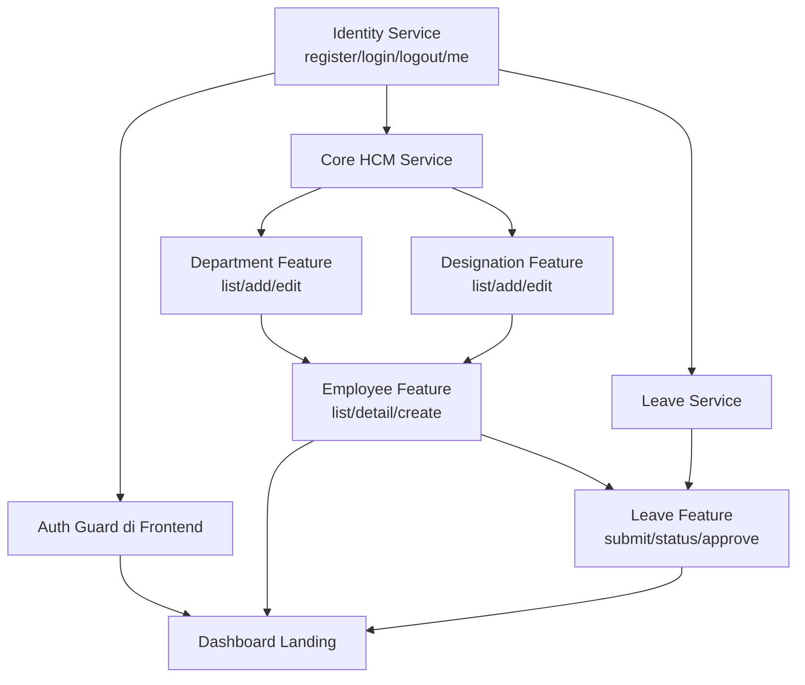
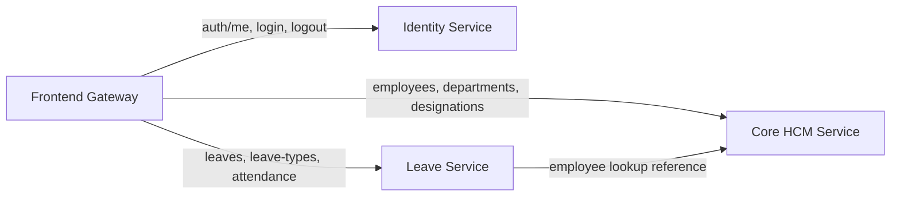

# Phase 1 Feature Relation Flowchart

Dokumen ini dibuat agar alur antar fitur mudah dibaca saat planning dan development.
Seluruh flow di bawah mengacu ke konsep arsitektur microservice.

## 1) Development dependency flow

## 2) Service interaction flow (gateway-centric)

## 3) API touchpoints per service

### Identity Service
- `POST /v1/identity/auth/register`
- `POST /v1/identity/auth/login`
- `POST /v1/identity/auth/logout`
- `GET /v1/identity/auth/me`

### Core HCM Service
- `GET /v1/hcm/employees`
- `GET /v1/hcm/employees/{id}`
- `POST /v1/hcm/employees`
- `GET /v1/hcm/departments`
- `POST /v1/hcm/departments`
- `PUT /v1/hcm/departments/{id}`
- `GET /v1/hcm/designations`
- `POST /v1/hcm/designations`
- `PUT /v1/hcm/designations/{id}`

### Leave & Attendance Service
- `GET /v1/leave/leaves`
- `POST /v1/leave/leaves`
- `POST /v1/leave/leaves/{id}/approve`
- `GET /v1/leave/attendance`
- `POST /v1/leave/attendance`
- `GET /v1/leave/leave-types`

## 4) Common API conventions

- Base URL convention:
  - Identity: `/v1/identity/*`
  - Core HCM: `/v1/hcm/*`
  - Leave: `/v1/leave/*`
- Error response:
  - `code` (string)
  - `message` (string)
  - `details` (optional object)
  - `traceId` (optional string)
- Health endpoint:
  - `GET /health` per service
