# Feature Flowcharts — Per Modul

> Dibuat 2026-06-22 berdasarkan mapping 100% runtime (`backend/routes/api/`, controller, model, docs/features/).

---

## 1. Identity & Auth

```mermaid
flowchart TD
    A[Guest] -->|Buka /landing| B[Landing Page]
    A -->|Buka /register| C[Register / Trial]
    A --> Buka /login D[Login Page]
    D -->|POST /v1/identity/auth/login| E{Valid?}
    E -->|Ya| F[HttpOnly cookie + accessToken]
    F --> G[Dashboard / Halaman tujuan]
    E -->|Tidak| D
    C -->|POST /v1/identity/auth/register| H{Company + User}
    H -->|Success| F
    G -->|GET /v1/identity/auth/me| I[Validate session]
    I --> J[Redirect ke login if expired]
```

## 2. Employees & Organization

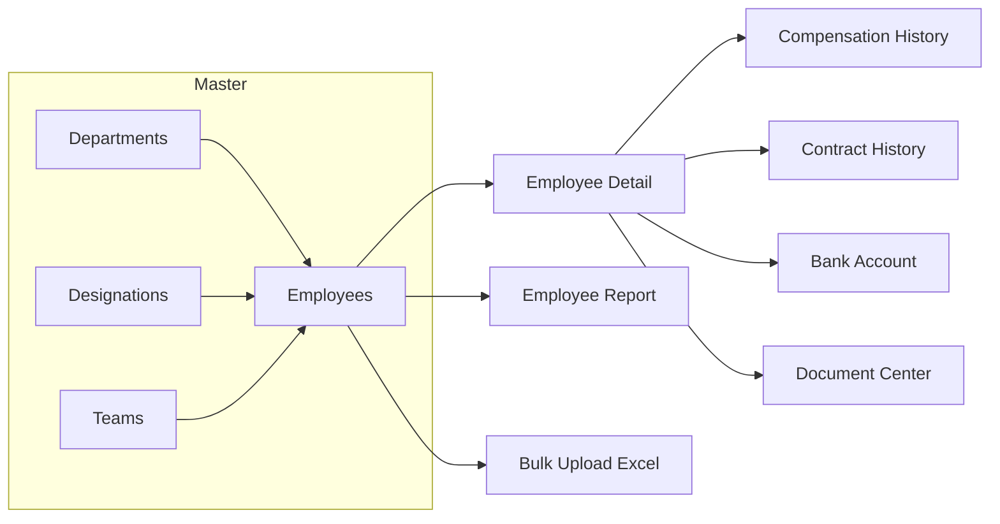

## 3. Attendance

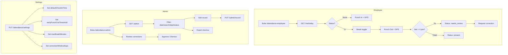

## 4. Selfie & Shift Schedule

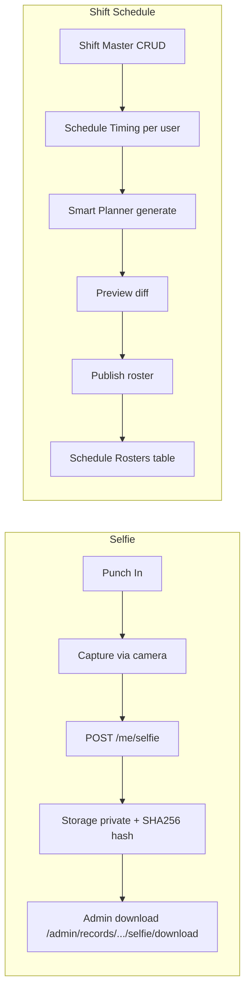

## 5. Leave & Holidays

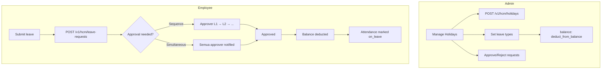

## 6. Overtime

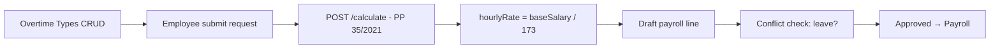

## 7. Payroll

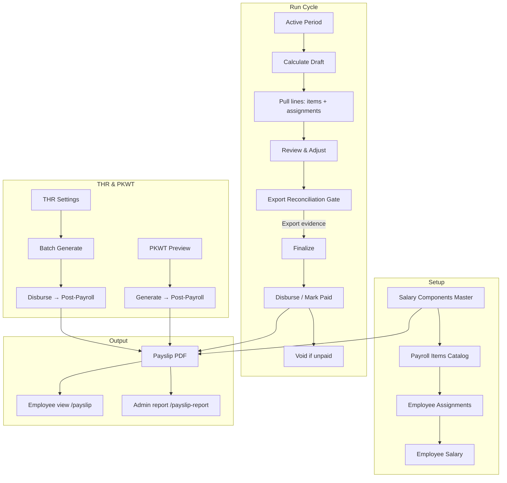

## 8. Performance & Growth

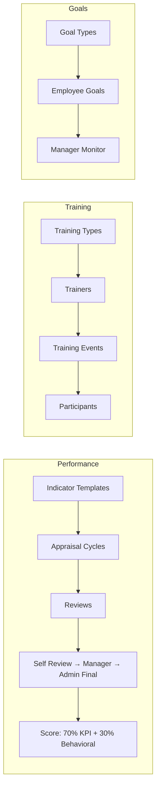

## 9. Employee Lifecycle

```mermaid
flowchart TD
    subgraph Promotion
        PRO1[Admin record promotion] --> PRO2[Department/Designation from→to]
        PRO2 --> PRO3[Snapshot preserved]
    end

    subgraph Resignation
        RES1[HR record resignation] --> RES2[Status: pending]
        RES2 --> RES3[Approved / Cancelled]
        RES3 --> RES4[resignationDate >= noticeDate]
    end

    subgraph Termination
        TER1[Draft_Review] --> TER2[Legal_Review]
        TER2 --> TER3[Approved_Internal]
        TER3 --> TER4[Finalized_Execution]
        TER4 --> TER5[Settlement Preview]
        TER5 --> TER6[Prorata + PKWT + Asset Clearance]
        TER3 -.-> TER7[Checklist blocks finalization]
    end
```

## 10. Asset & Tickets

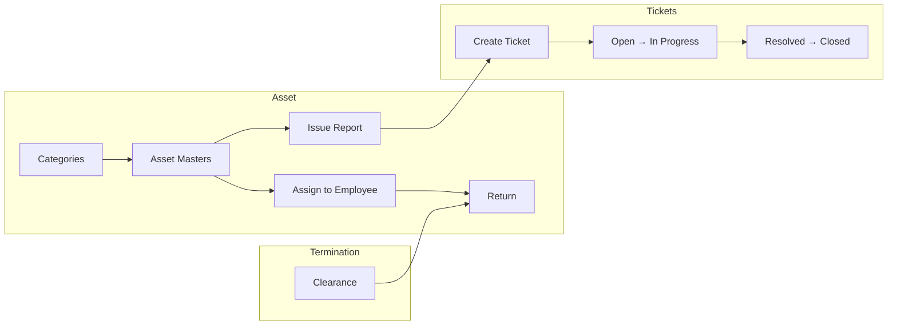

## 11. SaaS / Billing

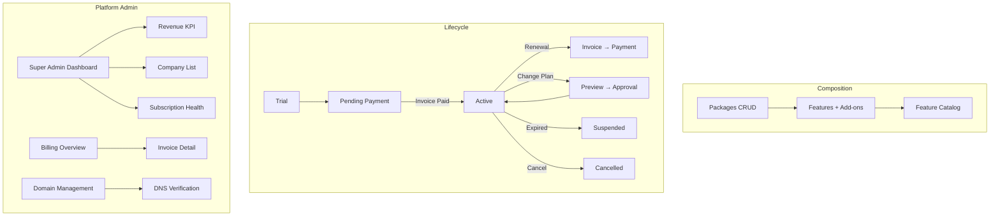

## 12. Governance

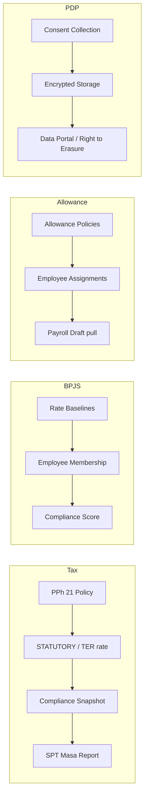

## 13. Notifications & Reporting

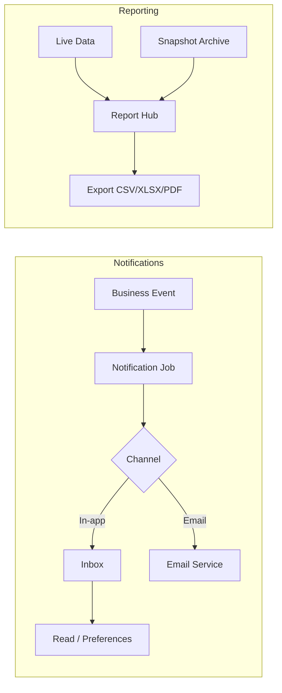

## 14. User Management & RBAC

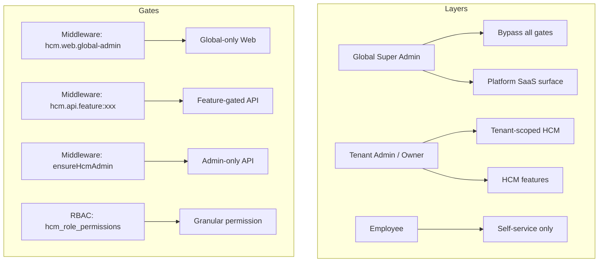

## 15. Inter-Module Data Flow

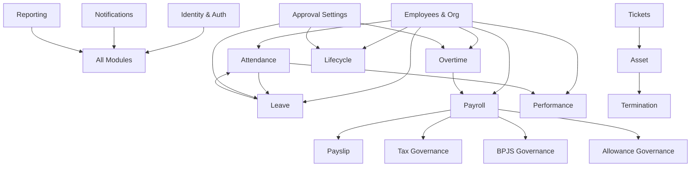

---

## 16. Attendance Selfie

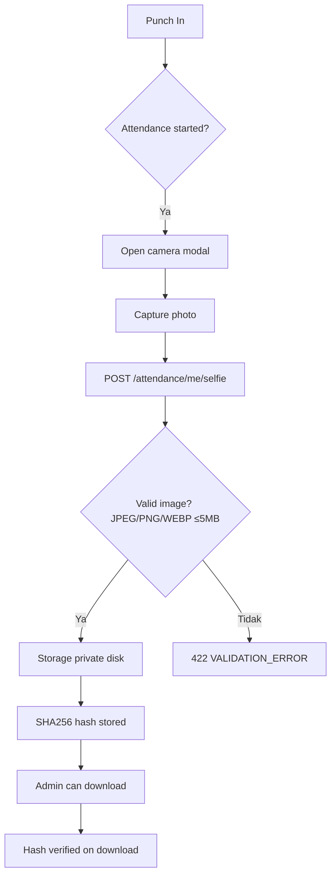

## 17. Attendance Shift Schedule

```mermaid
flowchart TD
    subgraph Master Data
        A[Shift CRUD] --> A1[start_time, end_time, isOvernight]
    end
    subgraph Per-User
        B[Schedule Timing] --> B1[Override per user]
        B1 --> B2[Link to shift or manual time]
    end
    subgraph Smart Planner
        C[Generate] --> C1[Load employees + shifts + rules]
        C1 --> C2[SmartAttendanceShiftingService]
        C2 --> C3[Draft roster]
        C3 --> C4[Preview]
        C4 --> C5[Publish → HcmScheduleRoster]
    end
    subgraph Timesheet
        D[GET /timesheets] --> D1[Filter dateFrom/dateTo/project]
        D1 --> D2[Sort by employee/date/worked]
    end
```

## 18. Payroll Salary Components (Detail)

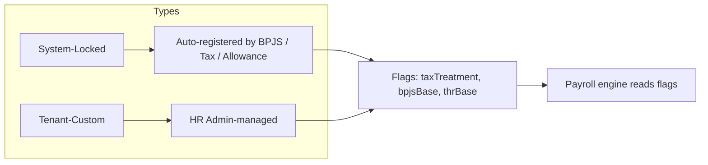

## 19. Payroll Items

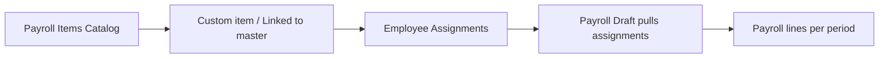

## 20. Employee Salary

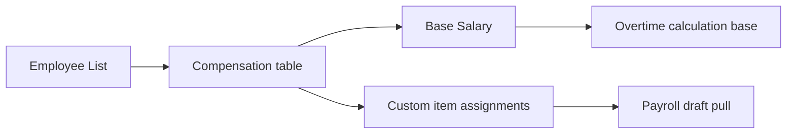

## 21. Payslip

```mermaid
flowchart TD
    A[Payroll finalized] --> B[Payslip generated]
    B --> C[Employee opens /payslip]
    C --> D{Apakah ada slip bulan ini?}
    D -->|Ya| E[Tampilkan slip terkini]
    D -->|Tidak| F[Fallback ke periode final terbaru]
    E --> G[Download PDF]
    F --> G
    B --> H[Admin view /payslip-report]
```

## 22. Payroll THR

```mermaid
flowchart TD
    A[Admin set THR settings] --> B[Holiday date + cut-off]
    B --> C[Batch generate eligible employees]
    C --> D[Pro-rata calculation]
    D --> E[Disburse / Mark Paid]
    E --> F[Post-Payroll → purpose: thr]
    F --> G[Employee sees in payslip]
```

## 23. Payroll PKWT Compensation

```mermaid
flowchart LR
    A[Select month] --> B[Preview PKWT contracts ending]
    B --> C[Tenure + compensation estimate]
    C --> D[Generate draft payroll → purpose: pkwt_compensation]
    D --> E[Mark Paid]
    E --> F[Appears in payslip]
```

## 24. Goal Tracking

```mermaid
flowchart LR
    A[Admin: Goal Types] --> B[Employee: Create Goals]
    B --> C[Scope: me / team / all]
    C --> D[Manager monitor progress]
    C --> E[Admin view all]
```

## 25. Training

```mermaid
flowchart LR
    A[Training Types] --> B[Trainers]
    B --> C[Training Events]
    C --> D[Assign participants]
    D --> E[Employee self-history view]
```

## 26. Promotion

```mermaid
flowchart TD
    A[Admin creates promotion] --> B[Select employee]
    B --> C[Department from→to]
    C --> D[Designation from→to]
    D --> E[Date effective]
    E --> F[Snapshot preserved in history]
```

## 27. Resignation

```mermaid
flowchart TD
    A[HR records resignation] --> B[noticeDate, resignationDate, reason]
    B --> C[Status: pending]
    C --> D{Admin action}
    D -->|Approve| E[Approved]
    D -->|Cancel| F[Cancelled]
    E --> G[resignationDate must >= noticeDate]
```

## 28. Termination

```mermaid
flowchart TD
    A[Create Termination] --> B[Draft Review]
    B --> C[Legal Review]
    C --> D[Approved Internal]
    D --> E[Checklist items mandatory]
    E --> F{All checklist done?}
    F -->|Ya| G[Finalized Execution]
    F -->|Tidak| H[Blocked]
    G --> I[Settlement Preview]
    I --> J[Prorata salary + PKWT comp]
    J --> K[Asset Clearance]
    G --> L[Update employee status]
```

## 29. Asset Management

```mermaid
flowchart TD
    A[Categories] --> B[Asset Masters]
    B --> C[Assign to employee]
    C --> D[Assignment history]
    D --> E[Return]
    B --> F[Issue report]
    F --> G[Creates Ticket]
    B --> H[Attach files]
    B --> I[Clearance via Termination]
```

## 30. Tickets

```mermaid
flowchart TD
    A[Create Ticket] --> B[Open]
    B --> C[In Progress]
    C --> D[Resolved]
    D --> E[Closed]
    A --> F[Set assignee + SLA]
    A --> G[Attachments]
    A --> H[Comments]
    E --> I[Locked for employee edits]
```

## 31. Policies

```mermaid
flowchart LR
    A[Policy CRUD] --> B[Optional department relation]
    A --> C[Attachments]
    A --> D[Gate: policy.manage]
```

## 32. Document Center

```mermaid
flowchart TD
    A[Categories] --> B[Upload Document]
    B --> C[Visibility: hr_only / employee_visible]
    C --> D[Employee sees own docs]
    C --> E[HR sees all]
    B --> F[Feature gate: employee_document_center]
```

## 33. Calendar

```mermaid
flowchart LR
    A[FullCalendar] --> B[Custom Events CRUD]
    A --> C[Holiday overlays (read-only)]
    A --> D[Leave overlays (read-only)]
    B --> E[Create / Edit / Delete / Drag-drop / Resize]
```

## 34. Notes

```mermaid
flowchart LR
    A[Create Note] --> B[Tag: Personal/Social/Work/Others]
    B --> C[Priority: Low/Medium/High]
    B --> D[Important flag]
    A --> E[Trash → Restore / Permanent Delete]
    E --> F[Per-user per-company scope]
```

## 35. FAQ

```mermaid
flowchart LR
    A[FAQ CRUD] --> B[Search / Filter / Sort]
    A --> C[Export CSV/JSON]
    A --> D[Bulk delete]
    A --> E[Audit trail]
```

## 36. Knowledgebase

```mermaid
flowchart LR
    A[config/hcm_knowledgebase.php] --> B[Categories]
    B --> C[Article per category]
    C --> D[Slug-based routes]
    D --> E[Legacy redirects]
```

## 37. Global Search

```mermaid
flowchart LR
    A[Ctrl+/ shortcut] --> B[Debounced query]
    B --> C[GET /v1/hcm/search]
    C --> D[Quick results dropdown]
    D --> E[Enter → Full results page]
    E --> F[RBAC-filtered results]
```

## 38. Locations / Wilayah Sync

```mermaid
flowchart TD
    A[Scheduler monthly] --> B[Sync from wilayah.id API]
    A --> C[Manual trigger via cronjob]
    B --> D[Local DB: provinces/regencies/districts/villages]
    C --> D
    D --> E[Server-side pagination + search]
    E --> F[Used by employee address + company locale]
```

## 39. Cronjob Scheduler

```mermaid
flowchart LR
    A[Settings per job] --> B[Time, timezone, enabled, dayOfMonth]
    B --> C[Kernel reads from settings table]
    C --> D[Scheduled tasks run]
    D --> E[Payment reminders]
    D --> F[Wilayah sync]
    D --> G[Payroll refresh]
    D --> H[Leave accrual]
    D --> I[SaaS billing automation]
```

## 40. Landing Pages

```mermaid
flowchart TD
    A[Guest lands] --> B[Hero / Features / Pricing]
    B --> C[Choose plan]
    C --> D[React onboarding modal]
    D --> E[Fill company + owner data]
    E --> F[Create subscription: trial / pending_payment]
    F --> G[Redirect to login / checkout]
    G --> H[Workspace or payment]
```

## 41. Approval Settings (Detail)

```mermaid
flowchart TD
    A[Admin opens /approval-settings] --> B[Load 6 modules]
    B --> C[leave, overtime, resignation, termination, expense, offer]
    C --> D[Pick module]
    D --> E[Set mode: sequence / simultaneous]
    E --> F[Pick approvers from company members]
    F --> G[Save → PUT /v1/hcm/approval-settings/{module}]
    C --> H[Integration with module lifecycle]
    H --> I[Leave request → populate approver chain]
    H --> J[Overtime → notify configured approvers]
    H --> K[Resignation / Termination → notify approvers]
```

## 42. Auto-Renewal (Subscription)

```mermaid
flowchart TD
    A[Scheduler scans subscriptions] --> B{renewal_due_at near}
    B -->|Ya| C[DB lock]
    C --> D[Create pending invoice]
    D --> E[Snapshot: plan + pricing + tax]
    E --> F[Attempt payment via gateway]
    F --> G{Success?}
    G -->|Ya| H[Mark paid + extend period]
    G -->|Tidak| I[Wait for webhook retry]
    H --> J[Send lifecycle notification]
```

## 43. Export Reconciliation

```mermaid
flowchart TD
    A[Financial action triggered] --> B{Export evidence exists?}
    B -->|Ya| C[Allow action: finalize / disburse / post-payroll]
    B -->|Tidak| D[Block action]
    D --> E[POST /v1/reconciliation/exports]
    E --> B
    A --> F[Payroll finalize]
    A --> G[THR disburse]
    A --> H[PKWT post-payroll]
    A --> I[Mark paid]
    A --> J[Invoice verify]
```

## 44. Export Governance

```mermaid
flowchart LR
    A[Standardize all exports] --> B[Default format: xlsx]
    B --> C[Server-side auth + tenant scope]
    C --> D[Consistent filename convention]
    D --> E[Audit trail per export]
    E --> F[Gradual migration legacy → standard]
```

## 45. Recovery Vault

```mermaid
flowchart LR
    A[CRUD event fire] --> B[Capture before/after payload]
    B --> C[Store immutable: actor, company, metadata]
    C --> D[Scheduled snapshots]
    D --> E[90-day hot retention]
    E --> F[Super admin investigate / restore]
```

## 46. AI Assistant

```mermaid
flowchart TD
    A[User asks NL question] --> B[Intent classifier]
    B --> C{RBAC gate}
    C -->|Allowed| D[Internal API call]
    D --> E[AI compose answer with provenance]
    C -->|Denied| F[Deny-by-default response]
    E --> G[Audit trail per query]
    F --> G
```

## 47. SPT Masa PPh 21

```mermaid
flowchart TD
    A[Payroll finalized] --> B[Generate SPT snapshot]
    B --> C[Review bruto + PPh21 totals]
    C --> D[Mark ready]
    D --> E[Submit]
    E --> F[Export CSV DJP format]
    C --> G[Status: draft → ready → submitted]
```

## 48. Employee Allowance Governance

```mermaid
flowchart TD
    A[Create allowance policy] --> B[Transport / Meal / Communication]
    B --> C[Assign to employee or org scope]
    C --> D[Versioned assignment history]
    D --> E[Payroll draft pulls active allowances]
    D --> F[Compliance engine detects gaps]
    F --> G[Missing required / expired / overlap]
```

## 49. Email Settings

```mermaid
flowchart LR
    A[Global admin configures] --> B[SMTP / Mailtrap]
    B --> C[Test connection endpoint]
    C --> D[Settings saved encrypted]
    D --> E[Laravel mailer reads active profile]
    E --> F[Inbound via webhook]
```

## 50. Super Admin Dashboard

```mermaid
flowchart TD
    A[/dashboard /saas-dashboard] --> B[Platform KPI cards]
    A --> C[Company list + status]
    A --> D[Revenue monthly chart]
    A --> E[Subscription health]
    A --> F[Audit logs]
    B --> G[Middlware: hcm.web.global-admin]
```

## 51. Trial & Billing Dashboard

```mermaid
flowchart LR
    A[Two tabs] --> B[Trial companies]
    A --> C[Subscribed companies]
    B --> D[Status: active / pending_payment / expired]
    C --> E[Invoice summary + due date]
    E --> F[Email delivery status]
    D --> G[Drill-down to invoice detail]
```

## 52. Packages

```mermaid
flowchart TD
    A[Super admin CRUD] --> B[Code, name, pricing]
    B --> C[Features assignment]
    C --> D[Add-ons catalog]
    B --> E[is_global_admin_only flag]
    E --> F[Internal vs public packages]
    C --> G[Landing pricing display]
    C --> H[Onboarding selection]
```

## 53. Subscriptions

```mermaid
flowchart TD
    A[Create subscription] --> B[Link company → package]
    B --> C[Lifecycle states]
    C --> D[Trial → Active]
    C --> E[Pending_Payment → Active on invoice paid]
    C --> F[Active → Suspended / Expired / Cancelled]
    C --> G[Change Plan: preview → approval]
    G --> H[Recurring renewal invoice]
    C --> I[Employee limit enforcement]
```

## 54. Purchase Transactions

```mermaid
flowchart LR
    A[Transaction ledger] --> B[Filter by invoice / company / status]
    A --> C[Create with company + subscription]
    A --> D[Export CSV]
    B --> E[Legacy + bearer purchase coexist]
```

## 55. Domain Management

```mermaid
flowchart LR
    A[Register domain] --> B[DNS verification instructions]
    B --> C[Admin triggers manual verify]
    C --> D[Status: verified / pending / failed]
    A --> E[UUID-based route binding]
```

## 56. Mock Payment

```mermaid
flowchart LR
    A[Tenant invoice] --> B[POST /mock-pay]
    B --> C[Create payment record]
    C --> D[Mark invoice paid]
    D --> E[Activate subscription from pending_payment]
    A --> F[Dev: /mock-payment-tester.html]
    A --> G[Dev: /mock-hosted-payment.html]
```

## 57. PDP Compliance (UU PDP)

```mermaid
flowchart TD
    A[Onboarding] --> B[Consent: biometric, AI, cookie]
    B --> C[Encrypted storage: NIK, NPWP, bank, payslip]
    C --> D[Data Saya portal: view / export]
    D --> E[Right to erasure workflow]
    D --> F[Breach notification system]
    C --> G[Data retention auto-purge]
    C --> H[Session timeout]
```

## 58. UUID Migration

```mermaid
flowchart LR
    A[Legacy integer IDs] --> B[Add UUID columns to tables]
    B --> C[Dual-write: int + uuid during migration]
    C --> D[API supports both identifiers]
    D --> E[Full PK cutover pending]
    D --> F[Some domains: uuid + numeric fallback]
```

## 59. 7-Table Integration Closure

```mermaid
flowchart LR
    A[tickets.category_id → ticket_categories] --> B[Added FK constraint]
    C[hcm_trainings.trainer_id → hcm_trainers] --> D[Added FK constraint]
    B --> E[Dual payload: legacy string + new FK]
    D --> E
    E --> F[Models + controllers + JS updated]
```

## 60. Security Check

```mermaid
flowchart TD
    A[Tier 1: Pre-push] --> B[Local verify: lint, gitleaks]
    B --> C[Tier 2: Pre-merge CI]
    C --> D[gitleaks, Semgrep ERROR]
    C --> E[composer audit, npm audit]
    E --> F[Tier 3: Pre-release DAST]
    F --> G[Penetration test surface]
```

## 61. Team Management

```mermaid
flowchart LR
    A[Create team] --> B[Cross-departmental workgroup]
    B --> C[Team lead assigned]
    C --> D[Members via employee form / bulk]
    D --> E[Shift/schedule planner supports team]
    D --> F[Delete blocked if members exist]
```

## 62. BPJS Governance

```mermaid
flowchart TD
    A[Rate Baselines] --> B[Kesehatan, JHT, JP, JKK, JKM]
    B --> C[Field-level lock on structural data]
    D[Employee Membership] --> E[BPJS Kesehatan number]
    D --> F[BPJS Ketenagakerjaan number]
    B --> G[Compliance score calculation]
    D --> G
```

## 63. Tax Governance

```mermaid
flowchart TD
    A[Admin creates PPh 21 policy] --> B[STATUTORY_PPH21 / TER]
    B --> C[Rate schedules]
    C --> D[Workflow: draft → submit → approve → publish → superseded]
    D --> E[Compliance snapshot]
    E --> F[Policy coverage / NPWP / PTKP quality]
    A --> G[Platform-level: SPT PPN / PPh23 reports]
```

## 64. BPJS Governance (Rate Detail)

```mermaid
flowchart LR
    A[Program: Kesehatan] --> B[Company rate % + Employee rate %]
    C[Program: JHT] --> D[Company rate % + Employee rate %]
    E[Program: JP] --> F[Company rate % + Employee rate %]
    G[Program: JKK] --> H[Risk-based rate]
    I[Program: JKM] --> J[Fixed rate]
    A --> K[Per-tenant with national fallback]
    C --> K
    E --> K
    G --> K
    I --> K
```

## 65. Inter-Module Data Flow (Lengkap)

```mermaid
flowchart LR
    ID[Identity Auth] --> ALL[All Modules]
    EMP[Employees] --> ATD[Attendance]
    EMP --> LV[Leave]
    EMP --> OT[Overtime]
    EMP --> PAY[Payroll]
    EMP --> PERF[Performance]
    EMP --> LIFE[Lifecycle]
    EMP --> TRAIN[Training]
    EMP --> GOAL[Goals]
    ATD --> PERF
    ATD --> LV
    LV --> ATD
    OT --> PAY
    PAY --> PAYSLIP[Payslip]
    PAY --> TX[TaxGovernance]
    PAY --> BPJS[BPJS]
    PAY --> ALW[Allowance]
    PAY --> SPT[SPTMasa]
    ASSET[Asset] --> TERM[Termination]
    TICKET[Tickets] --> ASSET
    APPROV[ApprovalSettings] --> LV
    APPROV --> OT
    APPROV --> LIFE
    NOTIF[Notifications] --> ALL
    REPORT[Reporting] --> ALL
    EXPORT[ExportReconciliation] --> PAY
    EXPORT --> THR[PayrollTHR]
    EXPORT --> PKWT[PayrollPKWT]
    EXPORT --> BILL[Billing]
    CRON[Cronjob] --> LOC[Locations]
    CRON --> SUB[Subscriptions]
    CRON --> SPT
    SUB --> BILL
    SUB --> DOMAIN[Domain]
    SUB --> AUTO_RENEW[AutoRenewal]
    PKG[Packages] --> SUB
    PKG --> LAND[LandingPages]
    LAND --> TRIAL[TrialBilling]
    TRIAL --> SUB
    PDP[PDPCompliance] --> ID
    PDP --> ATD
    PDP --> AI[AI Assistant]
    GUARD[SecurityCheck] --> ALL
    KNW[Knowledgebase] --> ALL
    SEARCH[GlobalSearch] --> ALL
```

---

## Catatan

- Flowchart di atas berdasarkan **runtime aktual** (`backend/routes/api/`, controller, model).
- Mermaid render di GitHub, VS Code, atau `https://mermaid.live/`.
- Update flowcharts ini jika route atau alur bisnis berubah secara substantif.
