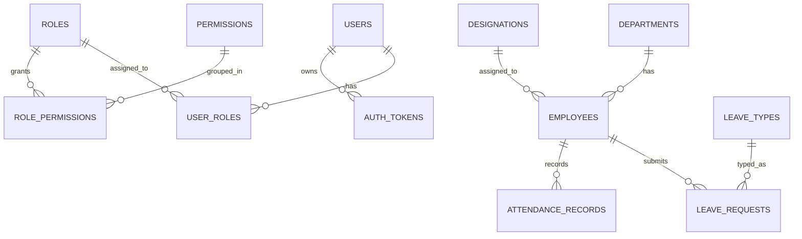

# ERD - Microservice Database (MySQL)

Dokumen ini mendefinisikan ERD konseptual untuk Phase 1 dengan pendekatan microservice.

## Scope

- Identity Service database
- Core HCM Service database
- Leave Attendance Service database
- Hubungan antar service dijaga lewat `reference id` (bukan foreign key lintas database)

## ERD per service

Catatan: relasi antar service pada diagram di bawah adalah relasi logis untuk business flow, bukan foreign key fisik lintas database.

## Cross-service relationship policy

- `hcm-core-service.employees.user_id` mereferensi `identity-service.users.id`
- `leave-attendance-service.leave_requests.employee_id` mereferensi `hcm-core-service.employees.id`
- Referensi lintas service divalidasi di layer aplikasi/API, bukan FK database lintas service

## Tabel inti per domain

### Identity Service

- `users`
- `roles`
- `permissions`
- `user_roles`
- `role_permissions`
- `auth_tokens`

### Core HCM Service

- `departments`
- `designations`
- `employees`

### Leave Attendance Service

- `leave_types`
- `leave_requests`
- `attendance_records`
